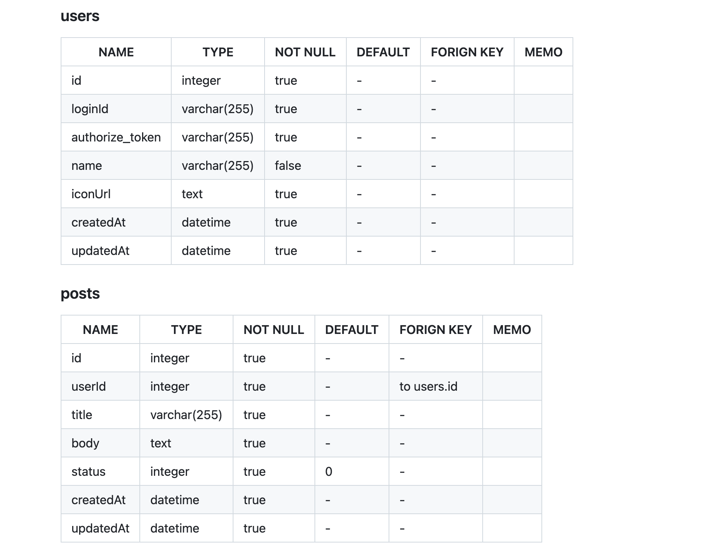
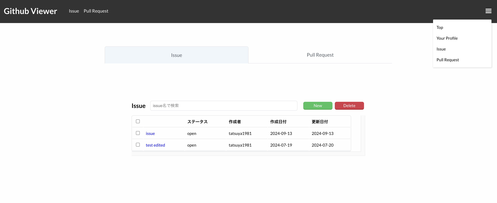

# 作成したアプリまとめ

2023 年 12 月 ～ 2024 年 7 月に作成したアプリのまとめです。

| <a href="" target="_blank">Petit-Marche</a> | <a href="https://github.com/tatsuya1981/Petit-Marche" target="_blank" >リポジトリ</a> |
| :-- | :-- |
|  | **【概要】**  コンビニエンスストアの商品を思い思いにレビューし、またそれらを参考にできるサービスです。 コンビニブランドや商品カテゴリー別、星評価などレビューしたい商品に対して細かく設定できます。  |
|              | **【今後の展望】**  <ul><li>商品のレビュー数や獲得いいね数のデータをグラフ化</li><li>新規開店・閉店情報</li></ul>など |

### ミニアプリ・ページ作成

| blog-api-express | <a href="https://github-viewer-2024.netlify.app" target="_blank" >github-viewer</a> |
| :--: | :--: |
|  |  |
| ブログ投稿型のシンプルなAPIです。バックエンドのキャッチアップで作成しました。 | 自身のリポジトリのissueに対してCRUDを実行するアプリです。 Reactを使ったAPI通信 のキャッチアップで作成しました。|
|          |              |
| <a href="https://github.com/tatsuya1981/blog-api-express" target="_blank">リポジトリ</a>| <a href="https://github.com/tatsuya1981/github-viewer" target="_blank">リポジトリ</a>|

| <a href="https://leaf-record.vercel.app" target="_blank">Leaf Record ～ 大草原不可避 ～</a> | <a href="https://sweet-spot-topi.vercel.app/" target="_blank">Sweet Spot!</a> |
| :--: | :--: |
|  |  |
| メモ帳感覚で GitHub にコミットできるサービスです。 外部 API を使用する練習として作成しました。 開発期間：1週間 | バレンタインチョコのシェアサービスです。 Next.jsの練習として作成しました。 開発期間：5日 |
|          |       |
| <a href="https://github.com/topi0247/leaf-record" target="_blank">リポジトリ</a> / <a href="https://qiita.com/topi_log/items/d362fefb9e006773eac0" target="_blank">Qiita</a> | <a href="https://github.com/topi0247/Sweet-Spot" target="_blank">リポジトリ</a> |

| <a href="https://hitotoki-album.onrender.com/" target="_blank">ひとときアルバム</a> | <a href="https://utyping-dbd8ac4df84a.herokuapp.com/" target="_blank">うたいぴんぐ♫</a> |
| :--: | :--: |
|  |  |
| お子さんの「はじめて」を写真に残す記録サービス Ruby on Railsの練習として作成しました。 開発期間：5日 | 合唱曲に合わせてタイピングするタイピングゲーム 開発期間：2日 |
|     |       |
| <a href="https://github.com/topi0247/mini-app-week" target="_blank">リポジトリ</a> | <a href="https://github.com/topi0247/utyping" target="_blank">リポジトリ</a> |
