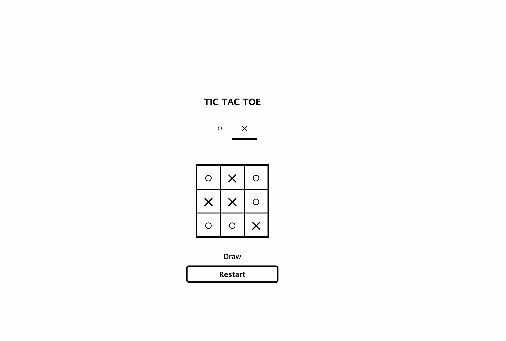
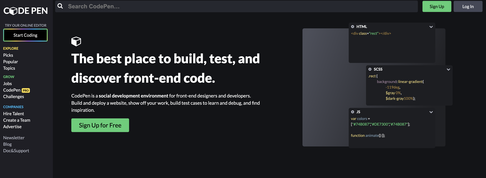

# 作成したアプリまとめ

2024 年 2 月 ～ 2024 年 9 月に作成したアプリのまとめです。

| Petit-Marche（作成中） | <a href="https://github.com/tatsuya1981/Petit-Marche" target="_blank" >リポジトリ</a> |
| :-- | :-- |
|  | **【概要】**  コンビニエンスストアの商品を思い思いにレビューし、各レビューを参考にできるサービスです。 コンビニブランドや商品カテゴリー別、星評価など レビューしたい商品に対して細かく設定できます。  |
|                | **【今後の展望】**  <ul><li>商品のレビュー数や獲得いいね数のデータをグラフ化</li><li>新規開店・閉店情報</li></ul>など |

### ミニアプリ・ページ作成

| blog-api-express | <a href="https://github-viewer-2024.netlify.app" target="_blank" >github-viewer</a> |
| :--: | :--: |
|  |  |
| ブログ投稿型のシンプルなAPIです。 バックエンドのキャッチアップで作成しました。  | 自身のリポジトリのissueに対して CRUDを実行するアプリです。 Reactを使ったAPI通信 のキャッチアップで作成しました。 |
|           |              |
| <a href="https://github.com/tatsuya1981/blog-api-express" target="_blank">リポジトリ</a>| <a href="https://github.com/tatsuya1981/github-viewer" target="_blank">リポジトリ</a>|

| <a href="https://tatsuya1981.github.io/react-tic-tac-toe/" target="_blank">三目並べゲーム</a> | <a href="https://tatsuya1981.github.io/ws-0100-codepen-copy/" target="_blank">codepenサイトの模写</a> |
| :--: | :--: |
|   |  |
| 誰もが１度は遊んだことがあるかも・・・？ Reactのキャッチアップとして作成しました。  | codepenサイトを想定した模写トレーニングです。 webサイト作成の練習として作成しました。 |
|        |      |
| <a href="https://github.com/tatsuya1981/react-tic-tac-toe" target="_blank">リポジトリ</a>| <a href="https://github.com/tatsuya1981/ws-0100-codepen-copy" target="_blank">リポジトリ</a>|

| <a href="https://tatsuya1981.github.io/EC_site_shampoo/" target="_blank">仮想ECサイトの作成</a> | 
| :--: | 
|  |
| シャンプーのECサイトを仮想したwebページ sassやページ遷移の練習として初めて作成したページです。 |
|      | 
| <a href="https://github.com/tatsuya1981/EC_site_shampoo" target="_blank">リポジトリ</a> | 
